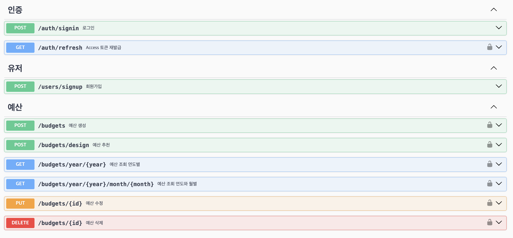

<div align="center">
  
</div>

# 예산 관리 어플리케이션

**개인 예산을 설정하고 지출을 관리하는 데 도움을 주는 애플리케이션입니다.**
본 서비스는 사용자들이 개인 예산를 설정하고 지출을 관리하는 데 도움을 주는 애플리케이션입니다. 이 앱은 사용자들이 예산을 설정하고 지출을 모니터링하며 재무 목표를 달성하는 데 도움이 됩니다.

<br/>

## Table of Contents

- [개요](#개요)
- [구현과정(설계 및 의도)](<#구현과정(설계-및-의도)>)
- [Directory](#directory)
- [TEST 전략](#TEST-전략)
- [API Reference](#api-reference)
- [ERD](#ERD)
- [TIL 및 회고](#til-및-회고)
- [Authors](#authors)

<br/>

## 개요

현대 사회에서 개인 지출 관리는 점점 더 중요한 요소가 되고 있습니다. 그러나 많은 사람들이 여전히 이를 어려움으로 느끼며, 그 결과 자산 관리를 제대로 하지 못하고 있습니다. 이에 대한 효과적인 해결책으로 "MoneyNote"를 소개드립니다.

이 애플리케이션은 사용자의 개인 예산를 설정하고 지출을 효과적으로 관리하는 데 도움을 제공합니다. 사용자는 자신의 예산을 설정하고, 지출을 모니터링하며, 재무 목표를 설정하고 달성하는 데 도움을 받을 수 있습니다.

사용자는 복잡한 재무 관리 과정을 단순화하고, 자신의 지출을 쉽게 추적하며, 자신의 재무 목표를 달성하는 데 필요한 지원을 받을 수 있습니다. 이러한 기능은 모두 사용자의 생활을 더욱 편리하고, 재무적으로 안정적인 것으로 만들어줍니다.
<br/>

## Skils

<div align="center">

언어 및 사용 도구 <br/>     
<br/>
데이터 베이스 <br/> 

</div>

## 구현과정(설계 및 의도)

### 유저 등록

- **회원가입**

  1. `계정`은 유저의 id를 기입

  2. `비밀번호`는 아래와 같은 `제약 조건`을 가지며, `암호화`하여 데이터베이스에 저장

  - 비밀번호는 최소 10자 이상
  - 숫자, 문자, 특수문자 3가지를 포함해야합니다.

- **로그인**
  1. 계정, 비밀번호로 로그인 시 JWT토큰이 발급됩니다.
  2. JWT 토큰은 `Access token`과 `Refresh token` 두개가 발급됩니다.
  3. 이후 게시물, 통계 API 요청 Header에 Access token가 항시 포함되며, JWT 유효성을 검증합니다.
  4. Aaccess token 만료시 Refresh token을 포함하여 재발급 요청시 Refresh 유효성 검증 후 Access토큰을 재발급합니다.

### 예산 설정

- **카테고리 금액 설정**

  1.  총 7가지의 카테고리 항목에 대한 예산금액 설정을 할 수 있습니다.
  2.  유저가 카테고리 별 예산 금액 설정을 할 수 있도록 모든 카테고리 목록을 반환합니다.

- **예산 금액 추천**
  1. 카테고리 별 예산 설정에 어려움이 있는 사용자를 위해 `예산 비율 추천 기능`이 존재합니다.
  2. 본인 제외 유저들이 설정한 카테고리 별 예산을 통계하여, 평균적으로 40% 를 식비에, 30%를 주거 에 설정 하였다면 이에 맞게 추천합니다.

### 지출 설정

- **지출 기록**

  1. - 지출을 `생성`, `수정`, `읽기(상세)`, `읽기(목록)`,`합계제외` 할 수 있습니다.
  2. `읽기(목록)` 은 아래 기능을 가지고 있습니다.
     - 필수적으로 `한달기준` 으로 조회 합니다.
     - 조회된 모든 내용의 `지출 합계` , `카테고리 별 지출 합계`, `주 카테리고 별 합계` 를 같이 반환합니다.
     - `합계제외` 처리한 지출은 목록에 포함되지만, 모든 `지출 합계`에서 제외됩니다.

- **오늘의 지출 금액 추천**

  1. 설정한 월별 예산을 만족하기 위해 오늘 지출 가능한 금액을 총액 과 카테고리 별 금액 으로 제공합니다.
  2. 지속적인 소비 습관을 위해 매일 아침 6시 webhook 알림을 보냅니다.

- **오늘의 지출금액 통계**
  1. 오늘 지출한 내용을 사용량(%)과 카테고리 별 지출상태를 알려줍니다.
  2. 지속적인 소비 습관을 위해 매일 오후 9시 webhook 알림을 보냅니다.

<br/>

## Directory

Nestjs의 특징을 살려 주요 기능별로 모듈(auth, budget, expense, user 등)이 나누어져 있습니다. 이는 애플리케이션의 기능을 독립적으로 관리하고 재사용성을 높이는 데 기여합니다. 또, common 디렉토리에 미들 웨어, 예외 필터, 인터셉터 등 애플리케이션 전반에 재사용될 수 있는 요소들을 모아두었습니다.
레이어드 아키텍처는 controllers, services, repository 등을 포함하여 MVC 패턴을 따랐습니다. 이는 코드의 역할을 분리하여 유지보수성과 확장성을 향상시킵니다. entities와 repositroies 디렉토리를 두어 데이터 액세스 레이어를 두었습니다. 복잡한 쿼리문은 repositories로 옮기는 작업을 할 예정입니다.
각 기능별로 test 디렉토리를 두어 BDD 방식으로 unit test를 진행했습니다. 이는 애플리케이션의 안전성을 높이는 데 기여합니다.

<summary> 파일 구조 보기 </summary>

```
src
├── auth
│   ├── controllers
│   ├── decorator
│   ├── dto
│   ├── jwt-strategies
│   ├── services
│   └── test
│   └── auth.module.ts
├── budget
│   ├── controllers
│   ├── dto
│   ├── entities
│   ├── pipes
│   ├── repositories
│   ├── services
│   ├── test
│   └── types
│   └── budget.module.ts
├── common
│   ├── exceptions
│   ├── interceptors
│   ├── middlewares
│   └── utils
├── config
├── expense
│   ├── controllers
│   ├── dto
│   ├── entities
│   ├── pipes
│   ├── repositories
│   ├── services
│   └── test
│   └── expense.module.ts
├── user
│   ├── controllers
│   ├── dto
│   ├── entities
│   ├── repositories
│   ├── services
│   ├── test
│   └── user.module.ts
├── webhook
├── app.module.ts
└── main.ts
```

</br>

## TEST 전략

코드베이스의 높은 품질과 견고성을 유지하기 위해, 행동 주도 개발(BDD) 테스트 방법론을 채택했습니다. 테스트 전략은 애플리케이션의 모든 측면이 검증될 수 있도록 세심하게 구성되었습니다.

### unit testing

각 모듈 내에 테스트 디렉토리를 구축하여 `Controller`와 `Service` 계층이 전용 unit test를 가지도록 했습니다.
unit test는 모든 실행 경로를 검토하여 성공하는 시나리오가 포함되도록 하였습니다.
현재 예상되는 실패 시나리오에 대한 케이스를 체계적으로 추가하고 있으며, 이를 통해 에러 처리 능력을 향상하고자 합니다.


### e2e testing

`app.e2e-spec.ts` 파일은 모든 API 응답에 대한 포괄적인 테스트를 포함하고 있습니다.
성공적인 응답과 실패한 응답에 사례를 모두에 균형적인 초점을 맞추어 테스트 커버리지 100% 달성을 향해 나아가고 있습니다.
이와 같은 포괄적인 접근 방식을 통해 어떤 회귀 문제도 신속하게 식별하고 수정할 수 있어, 애플리케이션의 무결성을 보장합니다.


<br/>

## API Reference

Swagger : http://localhost:{port}/swagger#/




## ERD


<br/>

## Authors

<div align="center">

</br>


<a href="https://github.com/wonn23">허창원</a>

</div>
<br/>
